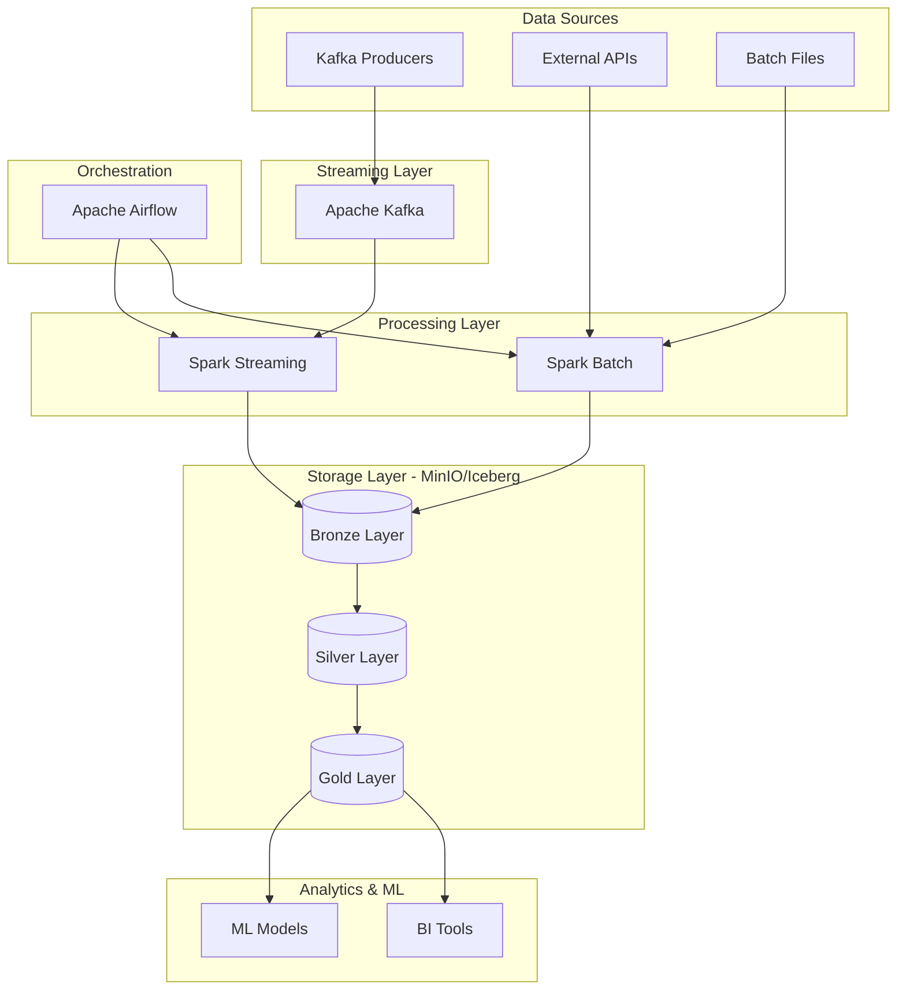
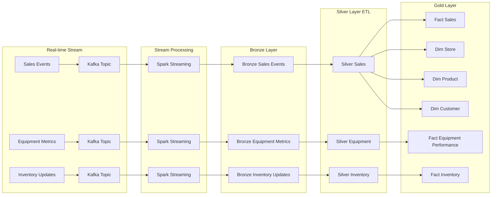
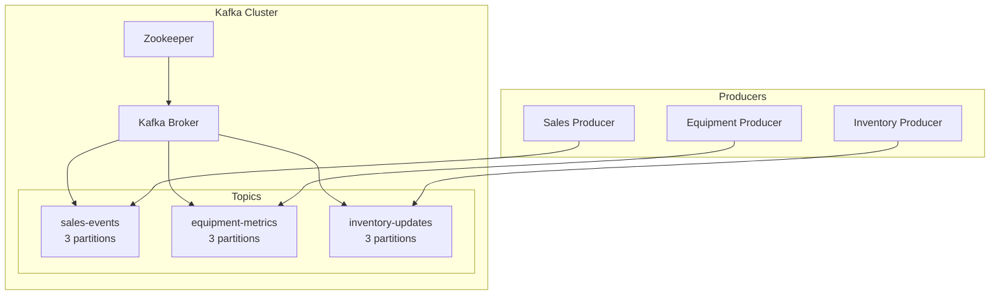
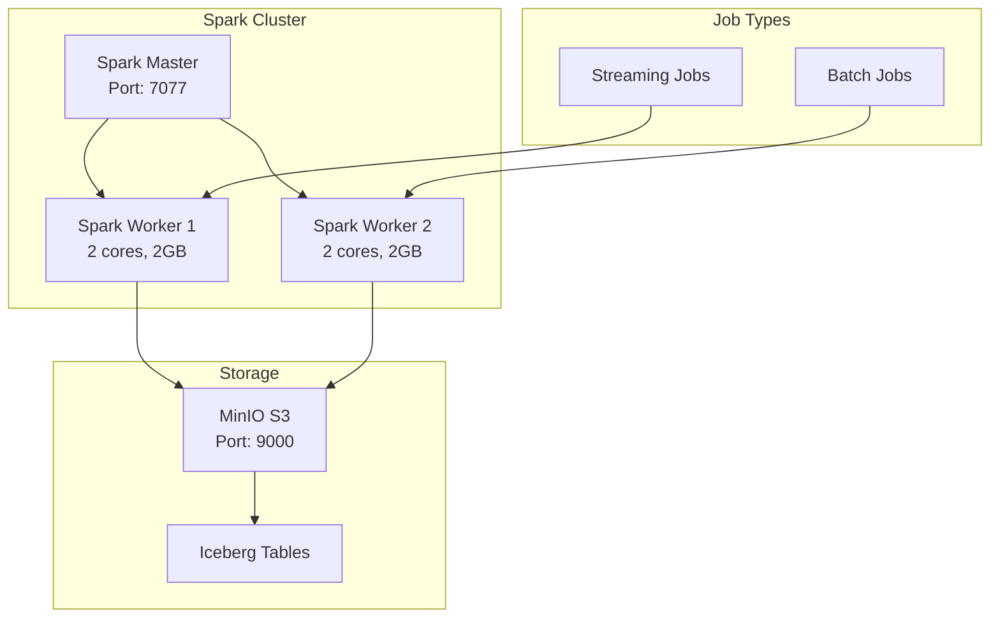
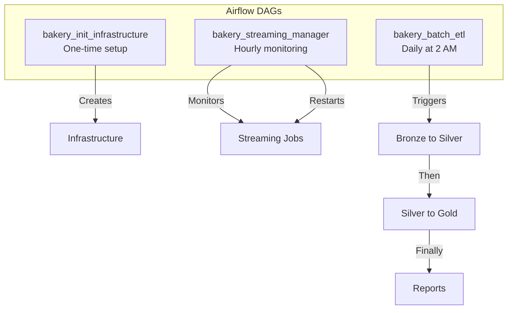
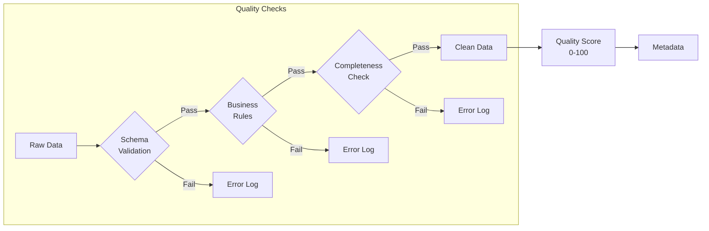
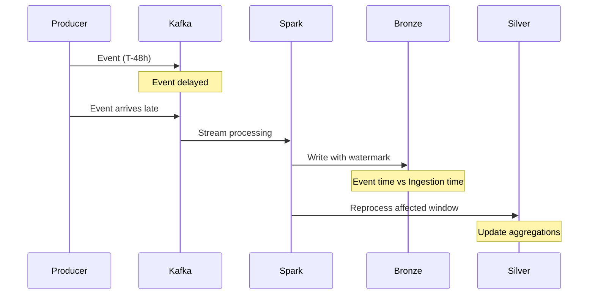
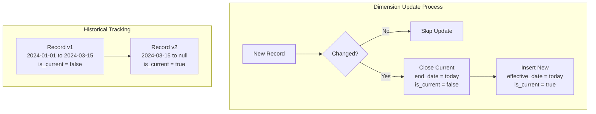
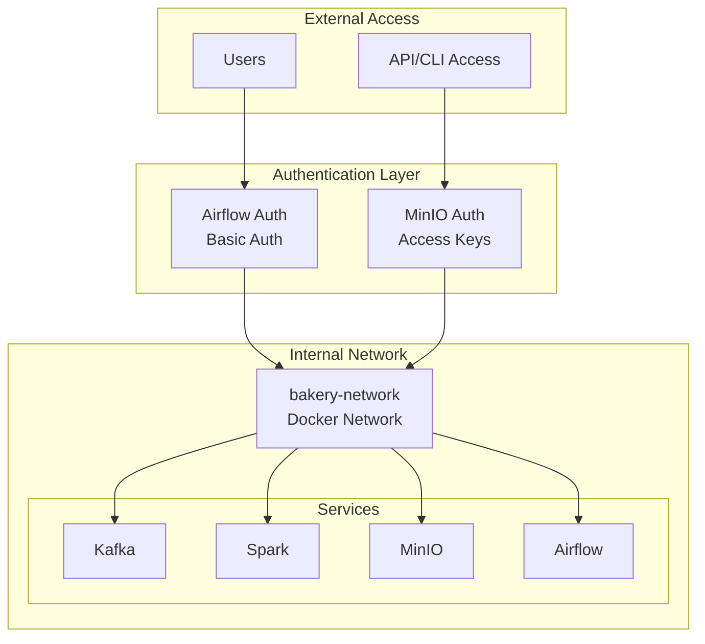

# Architecture Overview

## System Architecture

## Data Flow Pipeline

## Component Details

### 1. Streaming Infrastructure

### 2. Processing Architecture

### 3. Orchestration Flow

## Data Quality Pipeline

## Late Arrival Handling

## SCD Type 2 Implementation

## Security Architecture

## Scalability Considerations

### Horizontal Scaling

- **Kafka**: Add more brokers and increase partitions
- **Spark**: Add more workers for parallel processing
- **MinIO**: Add more nodes for distributed storage
- **Airflow**: Add more workers for concurrent task execution

### Vertical Scaling

- Increase memory and CPU for Spark executors
- Adjust JVM heap sizes for better performance
- Tune buffer sizes and batch intervals

### Data Partitioning Strategy

- **Bronze**: Partitioned by ingestion date
- **Silver**: Partitioned by event date
- **Gold**: Partitioned by business date
- **Iceberg**: Automatic partition evolution

## Monitoring Points

1. **Kafka Metrics**
   - Consumer lag
   - Message throughput
   - Topic partition distribution

2. **Spark Metrics**
   - Job duration
   - Task failures
   - Memory usage
   - CPU utilization

3. **Data Quality Metrics**
   - Records processed
   - Quality scores
   - Error rates
   - Late arrival statistics

4. **Storage Metrics**
   - MinIO bucket sizes
   - Iceberg table statistics
   - Compaction metrics 