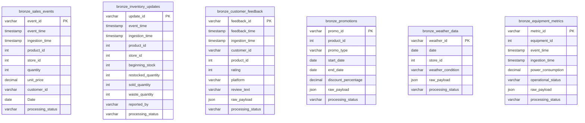
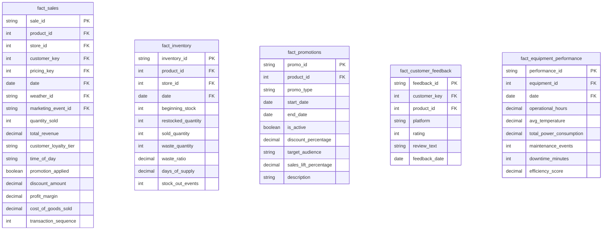

# Data Model Documentation

## Overview

This document describes the data model for the bakery data pipeline, organized into three layers:
- **Bronze**: Raw data ingestion
- **Silver**: Standardized and enriched data
- **Gold**: Business-ready dimensional model

## Bronze Layer - Raw Data Tables

## Silver Layer - Standardized Data

## Gold Layer - Dimensional Model

### Dimension Tables

### Fact Tables

### ML Feature Tables

## Relationships

### Gold Layer Relationships

## Key Design Decisions

### 1. SCD Type 2 Implementation
- **dim_store**: Tracks historical changes to store attributes (manager, hours, area)
- **dim_product_pricing**: Maintains price history with effective dates
- Uses `is_current_flag` and `effective_date`/`end_date` for temporal tracking

### 2. Late Arrival Handling
- Bronze layer includes `event_time` and `ingestion_time` to track delays
- Processing logic can identify records arriving up to 48 hours late
- Silver layer ETL processes update previously processed data

### 3. Data Quality
- Each silver table includes `data_quality_score`
- Validation rules applied during bronze-to-silver transformation
- Failed records stored separately for investigation

### 4. Partitioning Strategy
- Time-based partitioning on date columns for efficient querying
- Fact tables partitioned by date for optimal performance
- Enables efficient data lifecycle management

### 5. ML Feature Engineering
- Pre-computed features for three main use cases:
  - Demand forecasting
  - Equipment maintenance prediction
  - Product quality prediction
- Features updated incrementally as new data arrives 